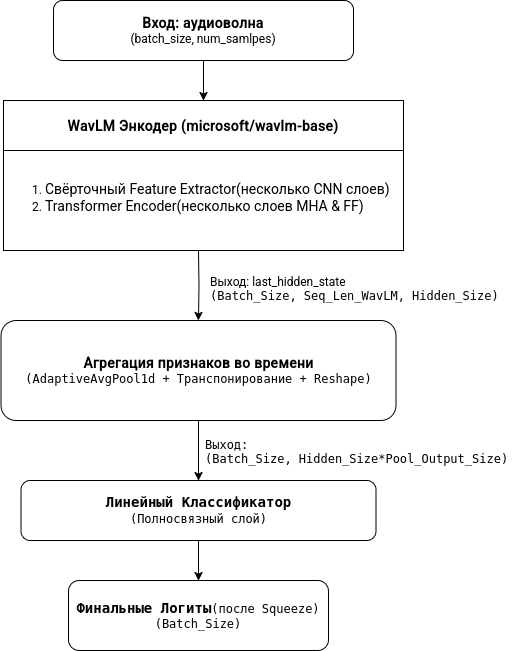

# Детекция аудиодипфейков с помощью WavLM

Этот проект представляет собой решение для задачи детекции аудиодипфейков. В основе лежит дообучение (fine-tuning) модели **WavLM-Base** на большом и разнообразном наборе данных, собранном из множества открытых источников.

Ключевой особенностью проекта является не только общая классификация аудио на "подлинное" и "фейковое", но и детальный анализ производительности модели в зависимости от типа атаки: **цифровой** (TTS, клонирование голоса) и **физической** (replay-атаки).

## Ключевые особенности

- **Модель**: Использование предобученной модели `microsoft/wavlm-base`.
- **Обширный датасет**: Объединение 8 различных датасетов, содержащих аудио на нескольких языках (с преобладанием русского и английского).
- **Анализ типов атак**: Данные классифицированы по типу атаки, что позволяет проводить детальную оценку сильных и слабых сторон модели.
- **Возобновляемое обучение**: Реализована логика сохранения и загрузки чекпоинтов, что критически важно для длительных экспериментов в средах с ограничением по времени (например, Kaggle).
- **Детальная оценка**: Расчет ключевых метрик (Accuracy, EER), построение матриц ошибок и ROC-кривых как для общего тестового набора, так и отдельно для каждого типа атак.

## Архитектура модели

Модель представляет собой стандартную архитектуру для классификации аудио на основе трансформера:
1.  **Основа**: Предобученная модель `microsoft/wavlm-base`, которая извлекает эмбеддинги из сырого аудио.
2.  **Пулинг**: Слой `AdaptiveAvgPool1d` для агрегации признаков по временной оси.
3.  **Классификационная голова**: Полносвязный слой (`nn.Linear`), который выдает один логит для бинарной классификации (подлинник/фейк).

  

## Результаты

Модель была дообучена на протяжении 5 эпох. Графики обучения показали стабильное снижение потерь и EER, а также рост точности без признаков переобучения. Финальный **EER на валидации составил 4.65%**.

### Финальная оценка на тестовой выборке

#### Общие результаты
| Метрика | Значение |
| :--- | :--- |
| **Accuracy** | **94.45%** |
| **EER** | **4.62%** |

#### Детальная оценка по типам атак
Анализ показал, что модель значительно лучше справляется с цифровыми атаками, которые составляли большую часть обучающего набора.

| Тип атаки | Accuracy | EER |
| :--- | :--- | :--- |
| **Digital** | **95.51%** | **3.67%** |
| **Replay** | **91.31%** | **7.67%** |

### Выводы
- Модель демонстрирует отличную обобщающую способность и высокую точность в задаче детекции аудиодипфейков.
- Наблюдается заметный разрыв в производительности между цифровыми и replay-атаками. EER для replay-атак более чем в два раза выше, что указывает на то, что модель менее устойчива к физическим атакам из-за их меньшей представленности в обучающих данных (26% против 74%).

## Дальнейшие шаги

- **Балансировка данных**: Увеличить количество или разнообразие replay-атак в обучающем наборе с помощью аугментации (наложение шумов, реверберации) или поиска новых источников.
- **Специализированное дообучение**: Дополнительно дообучить текущую модель 1-2 эпохи исключительно на данных с replay-атаками для улучшения ее производительности в этой области.
- **Анализ ошибок**: Глубже изучить примеры, на которых модель ошибается, чтобы выявить конкретные уязвимости.
